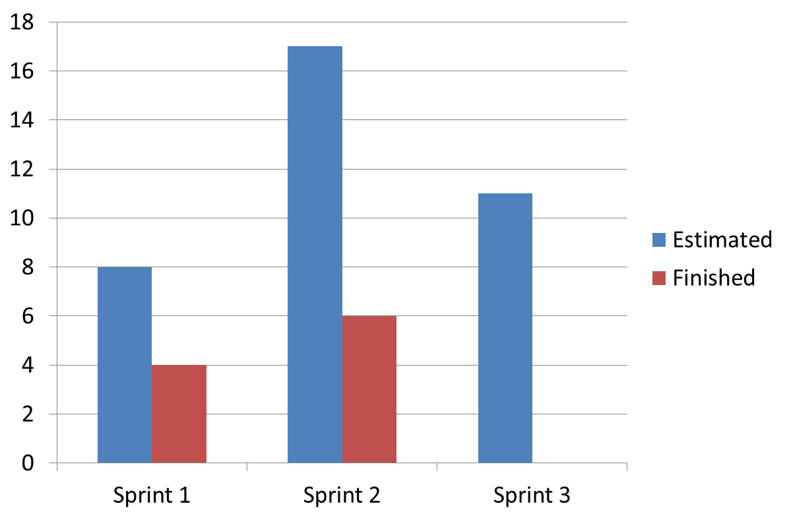

# deportesunq-backend
# Sprint 2

** Tareas a realizar el proximo sprint:

Backend: Api devolver competencias (En proceso)
Fronted: Consumir API del backend  (aun no comenzado)
Fronted: Mostrar competencias en pantalla (Modelado, en progreso)

* * Estimacion:
Backend: Api devolver competencias (3 puntos)
Frontend: Devolver competencias (8 puntos)

* * Servidor de CI:
Falta sincronizacion con repositorios GitHub.

* * Retrospectiva:
Puntos Altos:
	Compromiso con negocio de aplicacion
	Aceptacion de roles
	VSM mas visible
	Mejora de organizacion de equipo

Puntos Bajos:
	Estimacion incorrecta de tareas.
	Pocas interacciones presenciales
	
Gráfico de velocidad del sprint:

