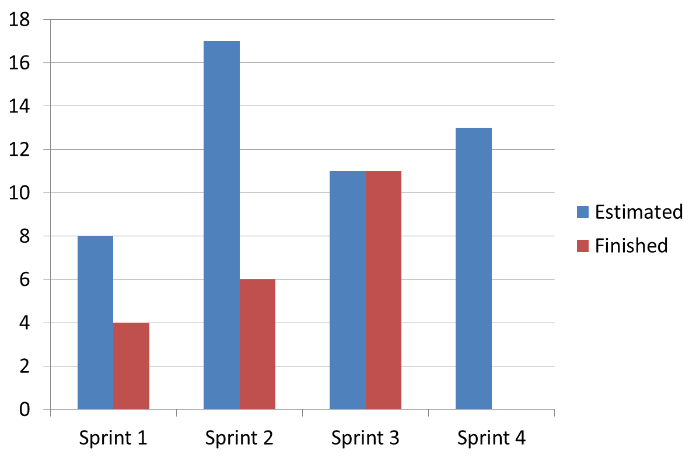

# Deportesunq >> SPRINT 3

## Tareas para el proximo sprint (Planning):

### API : Listar plantel ( Backend ):

		> Model

		> Mapping

		> Controler

		> Repository

### View : Listar plantel ( Frontend ):

		> Model 4

		> Client http

		> Interfaces

		> Fragment

		> ViewModel

		> Repository

## Estimacion:

### API : Listar plantel ( Backend ): 5 puntos

### View : Listar plantel ( Frontend ): 8 puntos

## Servidor de CI:

### Productivo (en backend corriendo con test sobre competencias)

## Retrospectiva:

### Puntos Altos:

	> Actualziacion del Trello: Separacion de listas, sprint por sprint, y bakclog incluido.

	> Mas interacciones presenciales (2). Post clase Miercoles, y Domingo. En donde pudimos acordar metodos mas simples para
	facilitar el uso de los datos, y la configuracion del jenkins.

	

### Puntos Bajos:
	
	> No se puedo persistir la base de datos, problema con el uso de google cloud plataform.
	
	> Problemas con los permisos del repositorio al intentar pushear.

	> Tiempo limitado, planning realizada el Domingo.

	
	
## Gráfico de velocidad del sprint:
