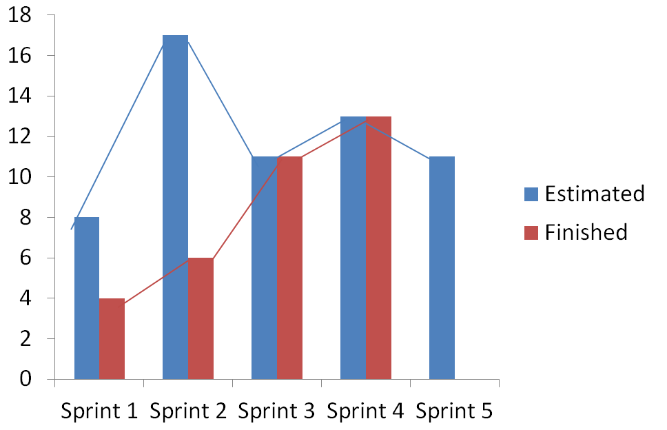

# Deportesunq >> SPRINT 4

## Tareas para el proximo sprint (Planning):

### API : Listar Campaña( Backend ):

		> Model

		> Mapping

		> Controler

		> Repository

### View : Listar Campaña( Frontend ):

		> Model 4

		> Client http

		> Interfaces

		> Fragment

		> ViewModel

		> Repository

## Estimacion:

### API : Listar Campaña ( Backend ): 3 puntos

### View : Listar Campaña ( Frontend ): 5 puntos

### DB : Agregar datos de campaña: 2 puntos

### Spike: Ionic Investigation: 1 punto

## Servidor de CI:

### Productivo (en backend corriendo con test sobre competencias)

## Retrospectiva:

### Puntos Altos:

	> Se decidio usar una base en memoria.

	> Refactorizacion en la semantica de corroboracion de test.

	

### Puntos Bajos:
	
	> Complejidad de progrmacion en android.
	
	> Poca interaccion grupal en la semana debido a distintas situaciones individuales de cada uno.

	
## Gráfico de velocidad del sprint:

